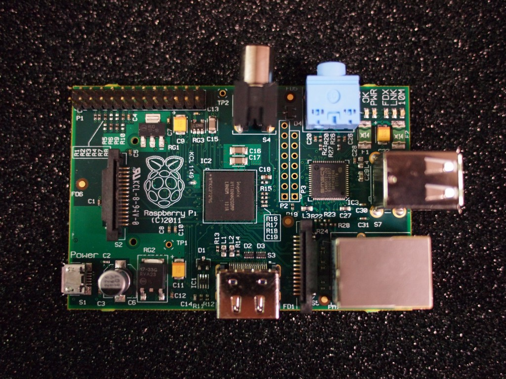
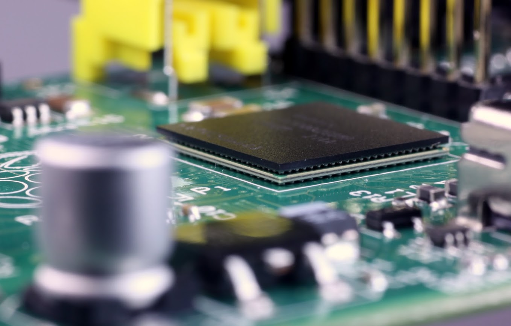

# Orígenes

Se trata de crear un sistema barato capaz de permitir enseñar a los niños (y a adultos) a programar.

* En 2005, la Universidad de Cambridge notó como cada vez menos estudiantes quería estudiar informática

* Pensaron que la solución podía ser un ordenador superbarato con el que pudieran jugar, aprendiendo en el camino.

* Se empezó a construir en 2006, pero era difícil

* En 2009 ya existía la tecnología necesaria y se creó "Raspberry Pi Fundation" administrada por Eben Upton

* En 2011 aparecen los primeros prototipos y se ven factibles modelos de 25$ y 35$. Aparece el modelo B Beta

Utiliza un diseño avanzado

[Modelos](./modelos.md)

[La llegada de los clones](./clones.md)
