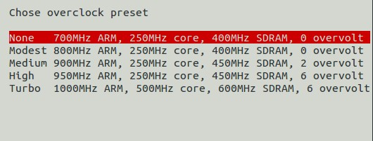

# Instalación

[¿Qué necesitamos?]

* Formatear tarjeta ([http://www.sdcard.org/downloads/formatter_4/](http://www.sdcard.org/downloads/formatter_4/))
* Descargamos la imagen [http://www.raspberrypi.org/download](http://www.raspberrypi.org/download)
* ¿Qué imagen usar?
	* Empecemos con [Noobs](https://www.raspberrypi.org/blog/tag/noobs/)
	* [Instalación](https://www.raspberrypi.org/help/noobs-setup/)

* ¡¡¡Arrancar!!!
* Configuración

## Configuración

	sudo raspi-config

(Puede variar algo según la versión)

Una vez configurado podemos abrir el entorno visual con 

	startx

En cualquier momento podemos volver a reconfigurar

	sudo raspi-config