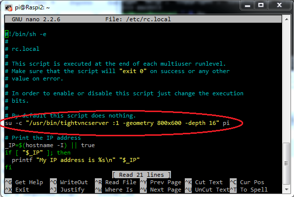

# Manejando tu Raspberry Pi

Como sabes es una máquina Linux, con lo que podrás manejarla igual que se maneja cualquier otra máquina Linux

## Consola (línea de comandos)

kindle(RP para agentes secretos)(The importance of a sneaky ...)

### Comandos básicos:

	* ls
	* cd
	* pwd
	* mv
	* rm
	* mkdir
	* passwd
	* ps -ef
	* top
	* clear
	* df
	* nano
	* vi
	* sudo halt
	* sudo shutdown -h now

### Usuarios

El usuario por defecto es "pi" con contraseña "raspberry"

### Cuidado con sudo

## Interface gráfico

## Acceso remoto

## [Conexión directa](./conexionDirecta.md)

## [Control con voz](./controlVoz.md)

### ssh

Es el protocolo de acceso por consola

Entramos en la configuración avanzada

	sudo raspi-config

Podemos hacerlo también por comandos con

	sudo service ssh start
	sudo insserv ssh

Ahora podremos conectarnos remotamente con ssh

	ssh pi@192.189.0.123

O bien usando algún software como [Putty](http://www.chiark.greenend.org.uk/~sgtatham/putty/download.html)

### vnc

VNC es un protocolo que nos permite acceder remotamente al escritorio de otra máquina. Podemos instalarlo en nuestra Raspberry de manera sencilla con

	sudo apt-get install tightvncserver

Este software requiere que un servicio se ejecute al arrancar si queremos acceder en cualquier momento. Podemos instalarlo añadiendo la siguiente línea al archivo /etc/rc.local

	su -c "/usr/bin/tightvncserver :1 -geometry 800x600 -depth 16" pi

