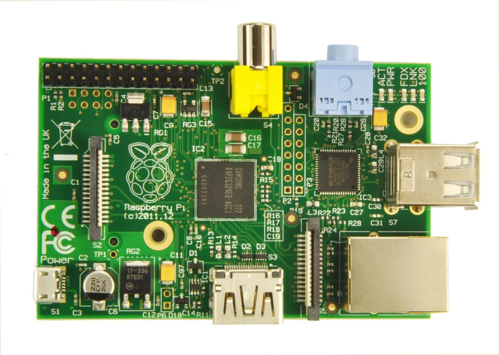

La [piZero se regala con una revista](https://www.raspberrypi.org/magpi/issues/40/)

( top: A+, 2, B+, bottom: A, 0&CM, B)

(tomado de [mikronauts](http://www.mikronauts.com/raspberry-pi/raspberry-pi-zero-pizero-review/))

[Comparativa de la piZero](http://www.mikronauts.com/raspberry-pi/raspberry-pi-zero-pizero-review/)

## [piZero ¡¡5$!!](https://www.raspberrypi.org/blog/raspberry-pi-zero/)

* Broadcom BCM2835, un 40% más rápido
* 512MB de memoria RAM
* mini-HDMI
* vídeo hasta 1080p a 60fps
* 2 microUSB para  datos y para alimentarse
* Puerto GPIO de 40 pines

# [Versiones](https://www.raspberrypi.org/documentation/hardware/raspberrypi/models/README.md)

[Versión 2 B](https://www.raspberrypi.org/products/raspberry-pi-2-model-b/)

* 900MHz
* 1Gb
* 4 USB ports
* 40 GPIO pins
* Full HDMI port
* Ethernet port

[Versión B+](https://www.raspberrypi.org/documentation/hardware/raspberrypi/models/README.md#modelbplus) 2014

Versión B (512M y ethernet)

Versión A (256MB)

[Tabla comparativa](https://www.raspberrypi.org/documentation/hardware/raspberrypi/models/specs.md)

[Comparativa Raspberry 2](https://learn.adafruit.com/introducing-the-raspberry-pi-2-model-b?view=all)
