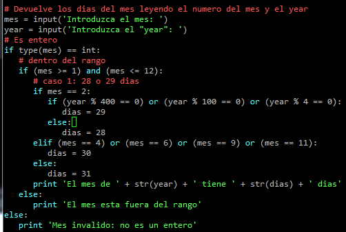
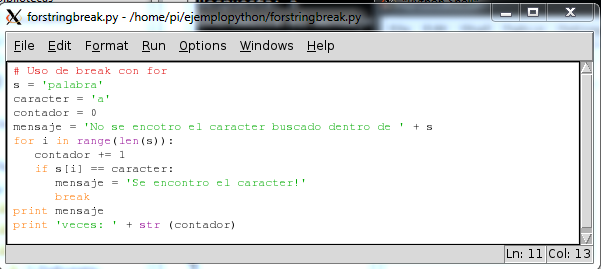
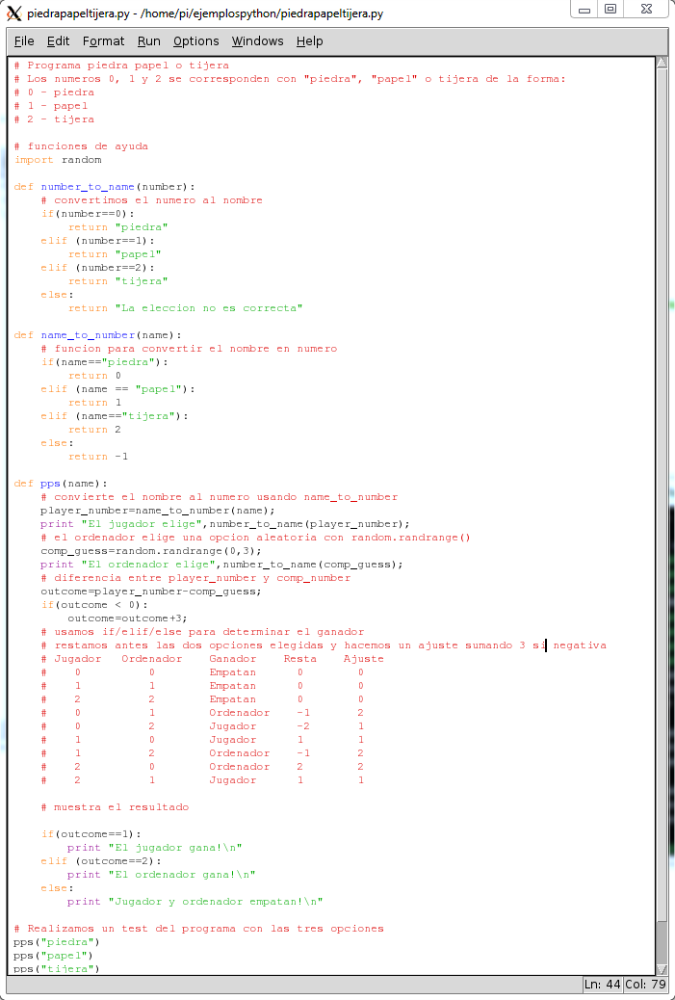

# python

Es un lenguage moderno de gran productividad, sencillo, potente y con millones de líneas ya desarrolladas que se pueden usar directamente por medio de paquetes instalables

Se utiliza en la web, en aplicaciones de escritorio, etc... Gran parte del interface de linux lo utiliza

Podemos utilizar la herramiente Idle o python directamente para programar con él.

Veamos algunos ejemplos

* Operaciones numéricas y petición de datos al usuario

* Sentencias de control condicionales

* Sentencias de control de repetición

* Diccionarios que nos permitirán relacionar contenidos

* Veamos una implementación de un programa más elaborado como "Piedra, Papel o Tijera"

