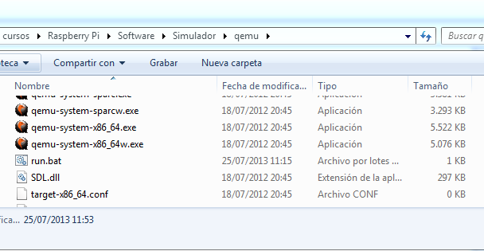

# Simuladores	

[simuladores](https://www.google.es/search?q=raspberry+simulator&oq=raspberry+simulator&aqs=chrome..69i57j69i65l3j69i60l2.3806j0j7&sourceid=chrome&es_sm=93&ie=UTF-8)

## [En windows](http://www.diverteka.com/?p=66)

* Descargamos la imagen en  [http://sourceforge.net/projects/rpiqemuwindows/](http://sourceforge.net/projects/rpiqemuwindows/) 
	* Emulador qemu
	* Imagen (2012-07-15-wheezy-raspbian.img) o (http://downloads.raspberrypi.org/download.php?file=/images/raspbian/2013-05-25-wheezy-raspbian/2013-05-25-wheezy-raspbian.zip)

* Ejecutamos

		qemu-system-arm.exe -M versatilepb -cpu arm1176 -hda imagen/2013-09-25-wheezy-raspbian.img -kernel kernel-qemu -m 192 -append "root=/dev/sda2″	

[Vídeo](http://www.youtube.com/watch?feature=player_embedded&v=QvqaNUx7-pU)

# [En ubuntu](http://www.cnx-software.com/2011/10/18/raspberry-pi-emulator-in-ubuntu-with-qemu/)

# [Simulando en virtualBox](https://www.raspberrypi.org/forums/viewtopic.php?f=9&t=2961)

Sobre la velocidad....

