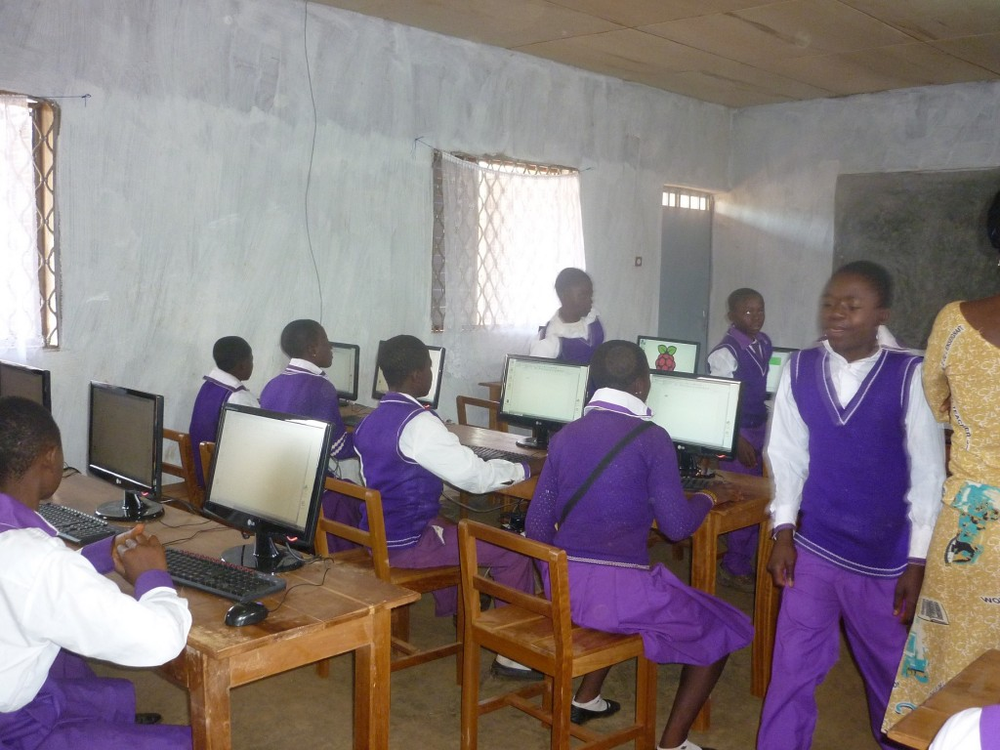
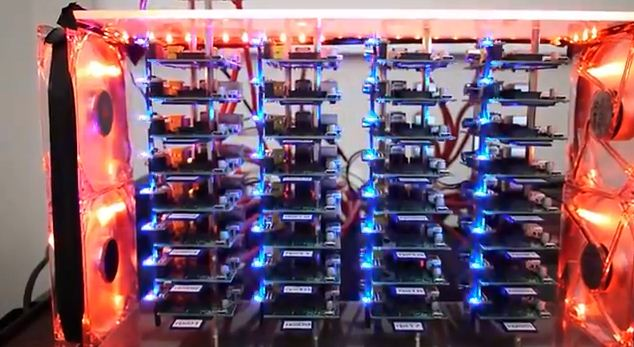
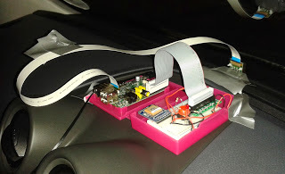

# Usos

## MediaCenter

[How to make a MediaCenter](https://learn.adafruit.com/raspberry-pi-as-a-media-center?view=all)

## Laboratorio

* Generador de onda
[DAC](https://learn.adafruit.com/mcp4725-12-bit-dac-with-raspberry-pi)

* [Analizador de precuencias](https://learn.adafruit.com/freq-show-raspberry-pi-rtl-sdr-scanner)

## Cerebro de una instalación domótica

[Regulación de temperatura](https://tackk.com/nightcooling)

## Servidor NAS

## Cortafuegos/acceso remoto

## Monitorización

## Sistema aislado recogida de datos

## Streaming

* [Radio wifi](https://learn.adafruit.com/pi-wifi-radio?view=all)

## [Hacking](./hacking.md)

## [Vigilancia](./vigilancia.md)

## Enseñanza

[Distribución educativa](https://learn.adafruit.com/adafruit-raspberry-pi-educational-linux-distro)

[Aulas informatica](https://www.raspberrypi.org/blog/bringing-computing-to-rural-cameroon/)

[Servidor de aula (Kahn Academy Offline)](http://www.raspberrypi.org/archives/3829?sf12291563=1)

	Raspebrry 35$
	SD 64Gb 50$
	Wifi USB 5$
	Caja 9$

## Robótica
[Raspberry y Lego Minstorm](https://learn.sparkfun.com/tutorials/getting-started-with-the-brickpi?_ga=1.260570443.733603098.1443800444)

## Data crunching

* [Cluster de supercomputación](http://www.cyberhades.com/2014/02/19/tutorial-para-instalar-un-cluster-de-40-nodos-con-raspberry-pi/)

* [Minería de BitCoin](https://learn.adafruit.com/piminer-raspberry-pi-bitcoin-miner)

## Cámara

[SnapPiCam](https://learn.adafruit.com/snappicam-raspberry-pi-camera)

## Máquina de juegos

* [Mame](https://learn.adafruit.com/retro-gaming-with-raspberry-pi?view=all)

* [Mini máquina recreativa](https://learn.adafruit.com/cupcade-raspberry-pi-micro-mini-arcade-game-cabinet?view=all)

* [Cómo instalar y jugar Doom](https://learn.sparkfun.com/tutorials/setting-up-raspbian-and-doom?_ga=1.227922267.733603098.1443800444)

* [Minecraft](https://learn.adafruit.com/running-minecraft-on-a-raspberry-pi)

# Instrumentos de tortura

* [Tortura a tu gato](https://learn.adafruit.com/raspberry-pi-wifi-controlled-cat-laser-toy?view=all)

* [Cuadro diabókico](https://learn.adafruit.com/creepy-face-tracking-portrait?view=all)

# Arte

*[Ligth Painting](https://learn.adafruit.com/light-painting-with-raspberry-pi)

* [Iluminación](https://learn.adafruit.com/neopixels-on-raspberry-pi)

* [Cortina luminosa](https://learn.adafruit.com/1500-neopixel-led-curtain-with-raspberry-pi-fadecandy?view=all)

# Portables

* [Raspberry Pi Gameboy](https://learn.adafruit.com/pigrrl-raspberry-pi-gameboy?view=all)

* [Super consola](https://learn.adafruit.com/super-game-pi?view=all)

# Teléfono

* [RaspiPhone](https://learn.adafruit.com/piphone-a-raspberry-pi-based-cellphone?view=all)

## Coche

[Datalogger de datos del coche](http://www.stuffaboutcode.com/2013/07/raspberry-pi-reading-car-obd-ii-data.html)

[Seguidor de flotas](http://www.stuffaboutcode.com/2013/10/raspberry-pi-car-cam-gps-data-map.html)

